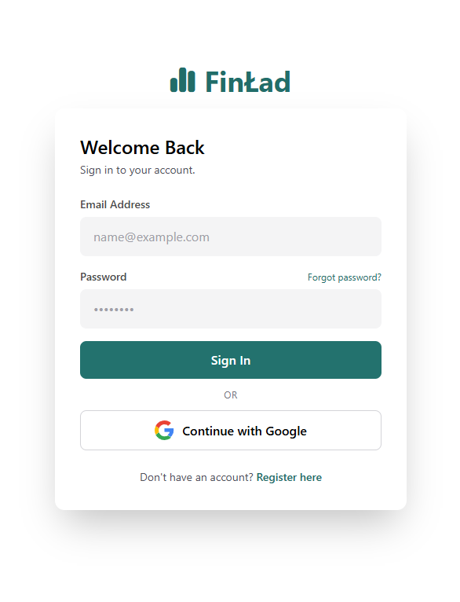
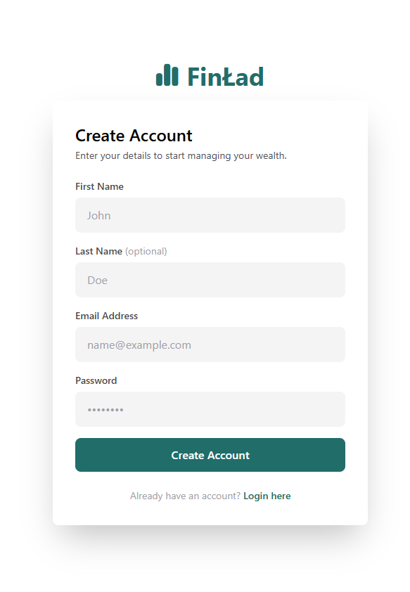
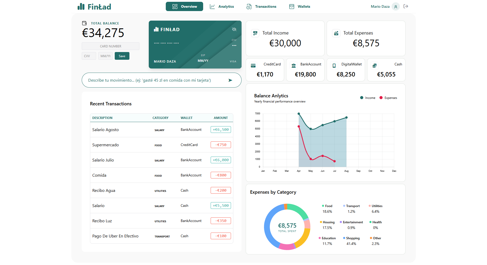
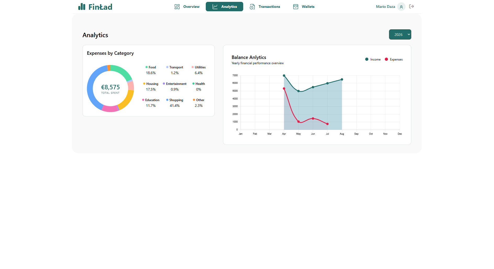
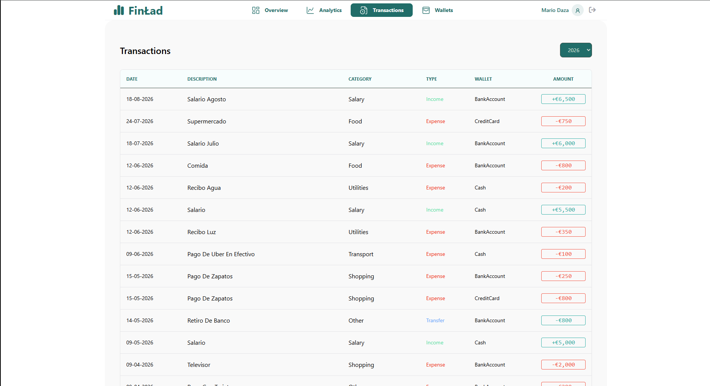
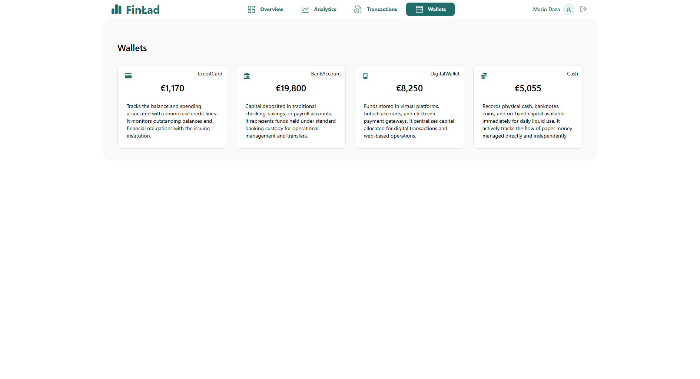

<h1 align="center">
  
  <br/>
  FinLad
</h1>

<p align="center">
  <b>Personal finance, powered by AI.</b><br/>
  <sub>Type naturally. Let AI handle the rest. No manual forms.</sub>
</p>

<p align="center">
  
  
  
  
  
  
  
</p>

---

## What is FinLad?

FinLad is a personal finance management web application that eliminates the friction of manual data entry. Instead of filling out forms with amount, category, wallet, date, and description fields, you simply type what happened in natural language — *"received my salary of 5,000 PLN deposited to my bank"* — and the AI engine parses, categorizes, and records the transaction instantly.

Built with a .NET 9 backend and Angular 21 frontend, FinLad supports income, expenses, and transfers between wallets, updates balances in real time via SignalR, and provides rich visual analytics through interactive charts. Authentication is handled via JWT with Google Sign-In integration, and the entire platform is designed to be responsive from mobile to desktop.

---

## Screenshots

<details>
<summary>🔐 Authentication</summary>
<br/>
<p align="center">
  <i>Login and registration with JWT, Google Sign-In, and password reset via email</i>
  <br/><br/>
  
  
</p>
</details>

<details>
<summary>📱 Dashboard</summary>
<br/>
<p align="center">
  <i>Main dashboard with total balance, wallet cards, AI input, charts, and recent transactions</i>
  <br/><br/>
  
</p>
</details>

<details>
<summary>📊 Analytics</summary>
<br/>
<p align="center">
  <i>Yearly analytics with expense breakdown by category and monthly income vs expenses chart</i>
  <br/><br/>
  
</p>
</details>

<details>
<summary>🧾 Transactions</summary>
<br/>
<p align="center">
  <i>Full transaction history with year filter, date, category, type, wallet, and amount columns</i>
  <br/><br/>
  
</p>
</details>

<details>
<summary>💳 Wallets</summary>
<br/>
<p align="center">
  <i>Wallet management with descriptions, icons, tags, and real-time balances</i>
  <br/><br/>
  
</p>
</details>


---

## How It Works

```
User types: "gasté 45 PLN en almuerzo con mi tarjeta de crédito"
     │
     ▼
┌─────────────┐    ┌──────────────┐    ┌──────────────┐
│  Angular    │───▶│  .NET API   │───▶│  DeepSeek AI │
│  Input UI   │    │  POST /ai   │    │  Parses text │
└─────────────┘    └──────┬───────┘    └──────┬───────┘
                          │                   │
                          │  ┌────────────────┘
                          ▼  ▼
                   ┌──────────────┐
                   │ Transaction  │
                   │ created +    │
                   │ wallet update│
                   └──────┬───────┘
                          │
                          ▼
                   ┌──────────────┐
                   │  SignalR Hub │
                   │  broadcasts  │
                   └──────┬───────┘
                          │
                          ▼
                   ┌──────────────┐
                   │ Dashboard    │
                   │ updates in   │
                   │ real time    │
                   └──────────────┘
```

---

## Features

### AI-Powered Transactions
- Natural language input — just type what happened
- Auto-detects transaction type (Income, Expense, Transfer)
- Smart category and wallet matching
- Brief descriptions — max 3 words, no payment method details
- Validation prevents garbage input and incomplete data

### Wallet Management
- 4 default wallets per user: Bank Account, Credit Card, Cash, Digital Wallet
- Real-time balance tracking across all wallets
- Transfer funds between wallets
- Balance validation prevents overspending

### Dashboard & Analytics
- Total balance across all wallets
- Wallet cards with live balances
- AI input bar with instant feedback
- Doughnut chart — expenses by category with percentages
- Line chart — monthly income vs expenses comparison
- Recent transactions table
- Toast notifications for real-time updates
- Year filter across all analytics views

### Security
- JWT-based authentication with Bearer tokens
- Google Sign-In integration
- Password reset via email (Gmail SMTP)
- Rate limiting on AI endpoint (5 req/min)
- Route guards for authenticated pages

### Responsive Design
- Mobile-first with Tailwind CSS 4
- Collapsible top navbar for desktop
- Bottom navigation bar for mobile
- All charts and tables adapt to screen size

---

## Tech Stack

| Category | Technology |
|----------|-----------|
| Backend | .NET 9 — ASP.NET Core Web API |
| Frontend | Angular 21 — TypeScript 5 |
| Styling | Tailwind CSS 4 |
| Charts | Chart.js via ng2-charts |
| Database | PostgreSQL — Supabase |
| ORM | Entity Framework Core 9 |
| Auth | JWT Bearer + Google Identity Services |
| Real-time | SignalR |
| AI | DeepSeek API (OpenAI-compatible) |
| Email | MailKit + Gmail SMTP |
| Testing | xUnit (.NET) |
| CI/CD | GitHub Actions |
| Backend Deploy | fly.io |
| Frontend Deploy | Vercel |

---

## Architecture

```
finlad-app/
├── backend/
│   └── src/
│       ├── Finlad.Domain/         # Entities, enums, base classes
│       └── FinLad.Api/            # Controllers, services, hubs, data
│           ├── Controllers/       # Auth, Wallet, Transaction, Category
│           ├── Services/          # AiService, TokenService, EmailService, etc.
│           ├── Hubs/              # SignalR TransactionHub
│           └── configurations/    # JwtSettings, AiSettings, EmailSettings
│
└── frontend/
    └── src/app/
        ├── core/                  # Shared services, guards, interceptors
        ├── features/              # auth, dashboard, wallets, analytics, transactions
        ├── shared/               # Reusable components and models
        └── layout/               # Navbar, mobile nav, main layout
```

---

## API Reference

| Method | Endpoint | Auth | Description |
|--------|----------|------|-------------|
| `POST` | `/api/auth/register` | No | Register new user |
| `POST` | `/api/auth/login` | No | Login, returns JWT |
| `POST` | `/api/auth/google` | No | Google Sign-In |
| `POST` | `/api/auth/forgot-password` | No | Send password reset email |
| `POST` | `/api/auth/reset-password` | No | Reset password with token |
| `GET` | `/api/wallet` | Yes | Get user wallets |
| `GET` | `/api/transaction?year=` | Yes | Get transactions (optional year) |
| `POST` | `/api/transaction/ai` | Yes | Parse NL into transaction |
| `GET` | `/api/transaction/monthly?type=&year=` | Yes | Monthly income/expense breakdown |
| `GET` | `/api/transaction/totals` | Yes | Year totals (income + expenses) |
| `GET` | `/api/category/expenses?year=` | Yes | Expenses grouped by category |

---

## Getting Started

```bash
git clone https://github.com/MarioDR25/FinLad.git
cd FinLad

# Backend
cd backend
cp src/FinLad.Api/appsettings.Example.json src/FinLad.Api/appsettings.json
# Configure your connection string, JWT key, DeepSeek API key, and email settings
dotnet run --project src/FinLad.Api

# Frontend
cd frontend
npm install
npm start
```

---

<p align="center">
  <sub>Built with .NET, Angular & DeepSeek</sub>
</p>
